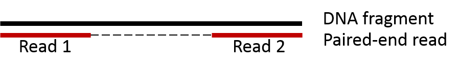
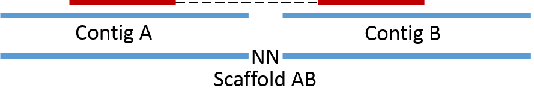
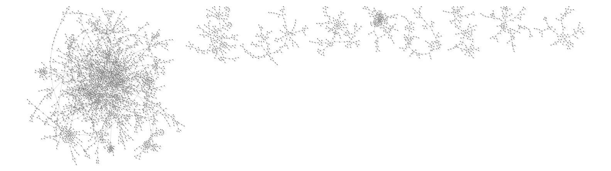
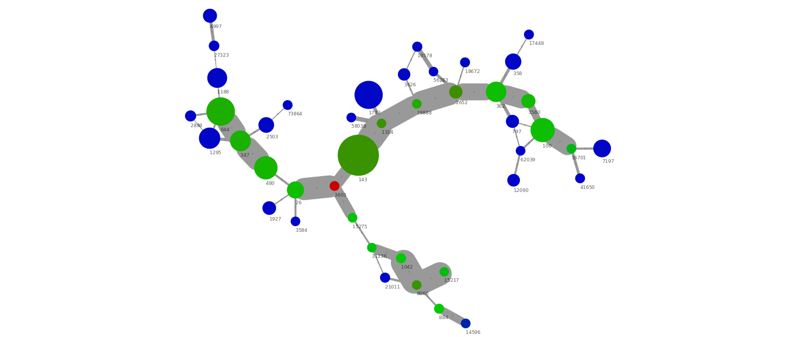
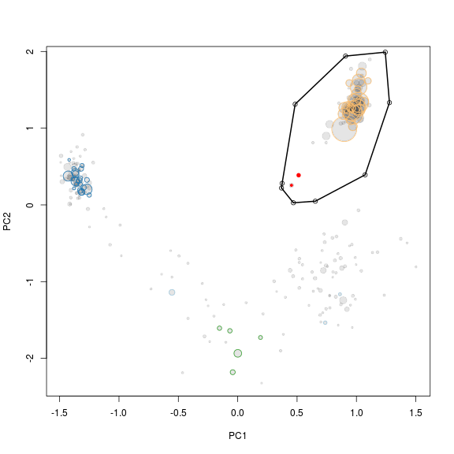

##Tracking paired-end reads
As some genes are present in multiple copies (e.g. 16S rRNA genes or transposases) they will not be included in the initial coverage-defined subset (see [Binning](step9.html)). Instead paired-end read information is used to associate multiple copy genes with the appropriate genome bin.

##Background
Paired-end (PE) reads are often generated when using the Illumina sequencing platform. DNA is fragmented into smaler pieces (200-700 bp) and then sequenced from each end. As the DNA fragments are larger than the length that can be sequenced, there will be unknown sequence between the two reads. However, the two reads originate from the same piece of DNA and can therefore be considered linked.

Paired-end information is utilized in the process of scaffolding, where assembled contigs are merged into scaffolds based on PE links. Here `contig A` and `contig B` can be merged together into `scaffold AB` as they are connected by a PE read.

Now consider the case where we have a repeat in the genome (i.e. a piece of DNA in multiple copies that can't be spanned by PE reads). Here we can not make a scaffold as we do not know if it should be `scaffold CE` or `scaffold CF` and `scaffold DE` or `scaffold DF`. However, we do know that the repeat is associated with contigs `E`, `C`, `D` and `F` and can therefore be said to originate from the same genome.

It's not just repeats that can be identified in this way. Short contigs can by chance (or extreme GC content) have a coverage that is significant different from the rest of the genome and therefore be excluded in the initial coverage defined bin. These can normally be picked up in through tracking of PE reads.

##Generating PE connections
The only file needed is a [SAM file](http://samtools.sourceforge.net/) of the read mappings to the assembled scaffolds, which is produced by most read mapping tools. The SAM file contains all information of the allignment of each specific read to the assembled scaffolds. The script takes a very simple approach to identifying PE reads. It assumes a read naming structure of `read1_1` and `read1_2`. A full readname of a Illumina PE read pair can be seen below, note that the readname prior to the underscore is identical between the two reads.


HWI-ST1040:48:c06lnacxx:2:1101:7493:111092_1:N:0:CAGATC
HWI-ST1040:48:c06lnacxx:2:1101:7493:111092_2:N:0:CAGATC


###Running the script 
The script `cytoscapeviz.pl` searches through the SAM file and identifies PE connections. The output is a file that states which scaffolds that are linked together. There are a few options that can be used to control the output:

`f` controls the minimum number of connections between scaffolds needed to call a link. In the example below at least 2 PE links are needed before the scaffolds are reported to be linked. 

`e` is used to only select links that map to the ends of the scaffolds, -`e` 500 means that only PE links mapping within 500 bp of each end is used to call links between scaffolds. 

`m` is used to set a minimum length of scaffolds that are reported to be circular, i.e. where a PE read pair map to each end of the same scaffold. 

`a` is the average length of the reads and is used to calculate the coverage for each scaffold.

`c` is a flag to get an additional condensed output. By default `cytoscapeviz.pl` generates connections for each end of all scaffolds. E.g. `scaffold 1` will be represented by the nodes `scaffold 1 start` and `scaffold 1 end`, however this can be a little messy to look at. Instead `c` is a flag stating that an additional condensed output should be made, where all scaffolds are represented by a single node (e.g. `scaffold 1`) instead of a start and end node. Always start by looking at the condensed output.


perl multi-metagenome/cytoscapeviz/cytpscapeviz.pl -i exampledata/mygenome.mapping.sam -f 2 -e 500 -m 3000 -a 125 -c


###Output
A minimal example SAM file is provided in `cytoscapeviz/exampledata`. It contains the mapping of reads to 2 contigs in order to show the princpiple of the script. The above command generates the following files `cytoscape.connections.tab`, `cytoscape.coverage.tab` and `cytoscape.length.tab` along with a `condensed.-` version of the same 3 files. 

The `.connections.` file contain the actual links between scaffolds which can be visualized in Cytoscape. It simply states that `contig1` and `contig2`are linked by 12 PE reads.


  node1  interaction    node2  connections
contig1	           0  contig2	        12


The `.coverage.` and `.length.` files are used to add attributes to the nodes (scaffolds) in Cytoscape.

##Visualising PE connections using Cytoscape
To visualise the connections we use the great open source tool [Cytoscape](http://www.cytoscape.org/). The output files are written for Cytoscape version 2.8.3, but also works for 3.0.

###Load the data into Cytoscape
As an example of a real network we have added the full condensed network from the paper in the folder `cytoscapeviz/full.albertsen.connection.network`. The network contains 57500 nodes and 42259 edges. To import the network in Cytoscape 2.8.3 use `File` -> `Import` -> `Network from Table`. Select the `.connections.` file and choose `source interaction` as `column 1`, `interaction type` as `column 2` and `target interaction` as `column 3`. In addition you can use `Show Text File Import Options` to transfer the first row as column names. Clicking on `column 4` loads the number of connections as attributes to the `edges` between the `nodes`.

The `.length.` and `.coverage.` attritubes are loaded using  `File` -> `Import` -> `Node attributes`. The file structure is very simple, which makes it easy to generate additional attribute files, e.g. using GC or taxonomy of essential genes, which can be exported from R.


Contiglength
contig1 = 11661
contig2 = 15454


###Generate an overview visualization
To generate the network right-click on the loaded network and press `create view`. To generate a nice overview of the network use `Layout` -> `Cytoscape Layouts` -> `Force-Directed Layout` -> `unweighted`. Note: you might need to [increase the memory for Cytoscape](http://wiki.cytoscape.org/How_to_increase_memory_for_Cytoscape) to apply the layout. This should generate the network show below (only the top row of clusters are shown).

###Using attributes to color the network
To really use the network visualisation we have to add more information. First we scale the width of the `edges` by the number of connections through: `View` -> `Open VizMapper` and then double click on `Edge Line Width` select `connections` and the `Mapping Type` as `Continuous Mapping`. You can now click the `Graphical View` to scale the edge line width with the numner of connections between the scaffolds.

The `nodes` are scaled by their length using `Node Size` with the `Contiglength` attribute and `Continuous Mapping`. The `nodes` are colored by their coverage through `Node Color` using `Contigcoverage` and `Continuous Mapping`. In the image below the color scale is from blue (40x coverage) to green (350x coverage) to red (600x coverage). 

The above small cluster of the network graph show several interesting things. First of all we have a group of connected scaffolds at a similar coverage (350x), which are connected through a high number of PE connections (i.e. wide edge lines). In addition, there seem to be a repeat (red, 600x coverage) in 2 copies that can be connected with the green scaffolds. There are also a number of low abundant scaffolds (blue, 40x) which are connected to the green scaffolds. This is a nice example of micro-diversity, where a low abundant strain (blue) interferes with the assembly of the high abundant strain (green) causing the assembly to be highly fragmented. 

##Extracting the network associated with a specific genome bin
While the complex network graphs look impressive the main purpose of the network analysis is to investigate the genome bins produced in R (see [Binning](step9.html)). There are three typical use cases. First of all to include repeats not included in the initial coverage-defined bin. Secondly, to remove any scaffolds wrongly included in the bin and finally to guide the manually finishing process (E.g. most of the green scaffolds above can be manually merged, even though the assembler didn't do it).

The script `cytoscape.extract.sub.graph.using.list.pl` takes a list of scaffold names and searches through the `.connection.` file to identify all scaffolds associated to the scaffolds in the input list. In this example we use the Verrumicrobia genome bin (`genome1.txt`) that was extracted in the [Binning section](step9.html). The file `genome1.txt` contains the names of the scaffolds included in the extracted bin and is used to extract the associated sub network.


perl cytoscape.extract.sub.graph.using.list.pl -c condensed.cytoscape.connections.tab -l genome1.txt


The script generates a few new files. `condensed.cytoscape.connections.tab.sub.txt` contains the sub network and the rather strange named file `genome1.txt.orginal.paint.cyto.txt` is an attribute file that makes it possible to identify the original scaffolds in the extracted network.

The files are loaded into Cytoscape just as they were in the previous example. To identify the original `genome1.txt` scaffolds we use the `Node Shape` attribute to make all orginal scaffolds (`OrgScaffolds`) a different shape than the scaffolds that were just linked to them using `Discrete Mapping`.

The generated network show a few nice things. All scaffolds in the original bin are round, with a black outline. The network clusters to the right side are from the target Verrumicrobia. It's easy to spot the three multicopy repeats as the red nodes with many connections. In addtion a number of short scaffolds have been included through the PE network analysis. The addition of the small scaffolds was also expected as we only used scaffolds >5000 bp in the R binning part. In theory a complete genome should have connections between all scaffold ends. However, the coverage of the target genome was only 50x and by chance this will result in areas of very low coverage.

Interestingly it can be seen that the large cluster to the left only contains two original scaffolds, the rest are huge scaffolds that were not in the initial bin (`genome1.txt`). Hence, it migth be that those two scaffolds were worngly included in the bin through R. To check this we simply mark the two scaffolds red in the R plot used for extraction (see below). The two scaffolds cluster quite distantly to the rest of the scaffolds and do indeed belong to another genome.

##Tips and tricks
Tip 1: The network analysis works much better with matepair data.
Top 2: You can often spot plasmids and circular phages as a single node that links to itself.

[Next: Reassembly](step11.html)

