## Wrighton data re-analysis
This small guide show the R part of the extraction of five OD1 genomes from the dataset generated by [Wrighton et al., 2012](http://www.sciencemag.org/content/337/6102/1661) and re-analysed by [Albertsen et al., 2013](http://www.nature.com/nbt/journal/vaop/ncurrent/abs/nbt.2579.html).

The R markdown version of the guide can be found [here]().

The raw metagenome reads were obtained from XX and de novo assembled as described in [Albertsen et al., 2013](http://www.nature.com/nbt/journal/vaop/ncurrent/abs/nbt.2579.html).

### Download the R formatted data.
Download and upack the Wrighton data used in Albertsen et al., 2013.


download.file('https://dl.dropbox.com/s/irahp88uleuqzv6/wrighton.tar.gz','wrighton.tar.gz', method = 'wget')
untar('wrighton.tar.gz')


### Load needed packages
In case you havn't installed all the needed packages, they can be installed via e.g. `install.packages('vegan')`. The version of R used to generate this file was:


R.version$version.string



"R version 3.0.1 (2013-05-16)"



library("vegan")
library("plyr")
library("RColorBrewer")
library("alphahull")
library("ggplot2")


### Load files associated with the Albertsen de novo assembly of the Wrighton data
All data except the three coverage estimates (`artur`, `dolly` and `chris`) was generated from a fasta file of the assembled scaffolds (`assembly.fa`) using the script: `workflow.R.data.generation.sh`. Coverage estimates for the scaffolds was obtained through CLC's short read mapper.


artur <- read.csv("assembly/artur.csv", header = T)
dolly <- read.csv("assembly/dolly.csv", header = T)
chris <- read.csv("assembly/chris.csv", header = T)

gc <- read.delim("assembly/assembly.gc.tab", header = T)
kmer <- read.delim("assembly/assembly.kmer.tab", header = T)
ess <- read.table("assembly/assembly.orfs.hmm.id.txt", header = F)
ess.tax <- read.delim("assembly/assembly.orfs.hmm.blast.tax.tab", header = F)
cons.tax <- read.delim("assembly/assembly.tax.consensus.txt", header = T)

colnames(kmer)[1] = "name"
colnames(ess) = c("name", "orf", "hmm.id")
colnames(ess.tax) = c("name", "orf", "phylum")
colnames(cons.tax) = c("name", "phylum", "tax.color", "all.assignments")


Merge all data on scaffolds into a single data frame `d`.


d <- as.data.frame(cbind(artur$Name, artur$Reference.length, gc$gc, artur$Average.coverage, dolly$Average.coverage, chris$Average.coverage), row.names = F)
colnames(d) = c("name", "length", "gc", "artur", "dolly", "chris")
d <- merge(d, cons.tax, by = "name", all = T)


Merge all data on essential genes into a single data frame `e`.


e <- merge(ess, d, by = "name", all.x = T)
e <- merge(e, ess.tax, by = c("name", "orf"), all.x = T)


### Load the original de novo assembly by Wrighton and the associated bins 
I added the data as a simple single text file in the `org.wrigton` folder. The assembled sequences and original bins were obtained from [here](http://genegrabber.berkeley.edu/Rifle_ACD/organisms).


w.d <- read.delim("org.wrighton/acd.genomes.txt", header = T)


### Define a few functions for later use
Calculate basic statistics on a set of scaffolds.


genome.stats <- matrix(NA, nrow = 0, ncol = 10)
colnames(genome.stats) <- c("total.length", "# scaffolds", "mean.length", "max.length", "gc", "artur", "dolly", "chris", "tot.ess", "uni.ess")

calc.genome.stats <- function(x, y) matrix(c(sum(x$length), nrow(x), round(mean(x$length), 1), max(x$length), round(sum((x$gc * x$length))/sum(x$length), 1), round(sum((x$artur * x$length))/sum(x$length), 1), round(sum((x$dolly * x$length))/sum(x$length), 1), round(sum((x$chris * x$length))/sum(x$length), 1), nrow(y), length(unique(y$hmm.id))), dimnames = list(colnames(genome.stats), ""))


Extract a subset of scaffolds.


extract <- function(x, a.def, v1, v2) {
    out <- {}
    for (i in 1:nrow(x)) {
        if (inahull(a.def, c(v1[i], v2[i]))) 
            out <- rbind(out, x[i, ])
    }
    return(out)
}


GC color scheme.


rgb.c <- colorRampPalette(c("red", "green", "blue"))
rgb.a <- adjustcolor(rgb.c(max(d$gc) - min(d$gc)), alpha.f = 0.5)


## Initial overview of the data


calc.genome.stats(d, e)



total.length 171324044.0
# scaffolds      62199.0
mean.length       2754.5
max.length      220980.0
gc                  43.5
artur               14.7
dolly               15.0
chris               17.5
tot.ess           5800.0
uni.ess            108.0


To get an initial overview of the data we only use scaffolds > 5000 bp.


ds <- subset(d, length > 5000)
es <- subset(e, length > 5000)


### Coverage plots - Colored by GC


ggplot(ds, aes(x = artur, y = chris, color = gc, size = length)) + 
  scale_x_log10(limits = c(0.5, 200)) + 
  scale_y_log10(limits = c(1, 300)) + 
  xlab("Coverage (artur)") + 
  ylab("Coverage (chris)") + 
  geom_point(alpha = 0.5) + 
  scale_size_area(name = "Scaffold length", max_size = 10) + 
  scale_colour_gradientn(colours = c("red", "green", "blue"))


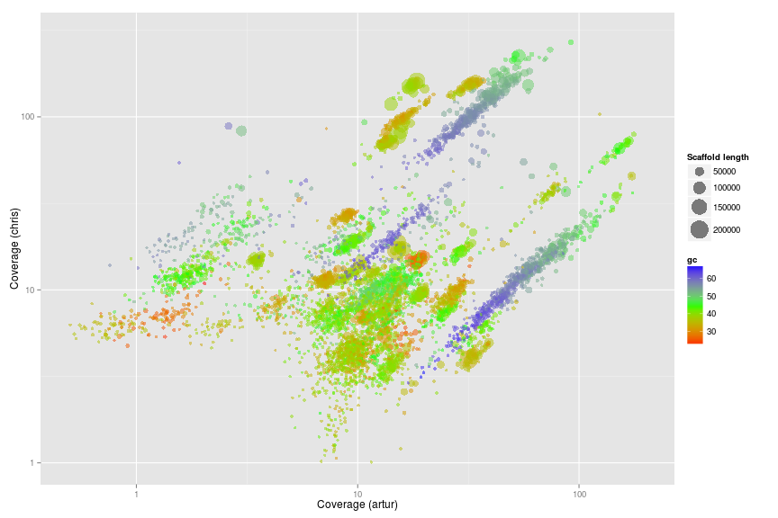 

### Original Wrighton coverage plots - Colored by GC


w.ds <- subset(w.d, length > 5000)



ggplot(w.ds, aes(x = artur, y = chris, color = gc, size = length)) + 
  scale_x_log10(limits = c(0.5, 200)) + 
  scale_y_log10(limits = c(1, 300)) + 
  xlab("Coverage (artur)") + 
  ylab("Coverage (chris)") + 
  geom_point(alpha = 0.5) + 
  scale_size_area(name = "Scaffold length", max_size = 10) + 
  scale_colour_gradientn(colours = c("red", "green", "blue"))


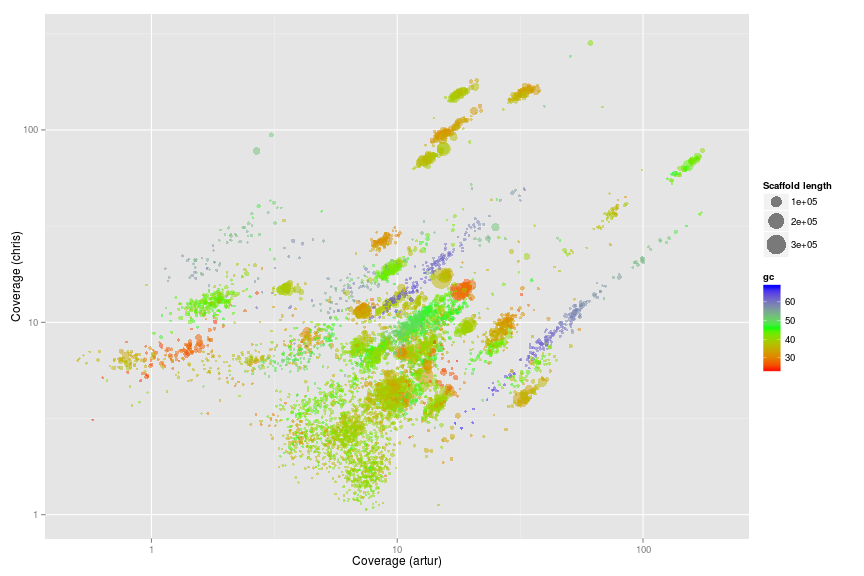 

### Original Wrighton coverage plots - Colored by bins


ggplot(w.ds, aes(x = artur, y = chris, color = bin, size = length)) + 
  scale_x_log10(limits = c(0.5, 200)) + 
  scale_y_log10(limits = c(1, 300)) + 
  xlab("Coverage (artur)") + 
  ylab("Coverage (chris)") + 
  geom_point(alpha = 0.5) + 
  scale_size_area(name = "Scaffold length", max_size = 10)


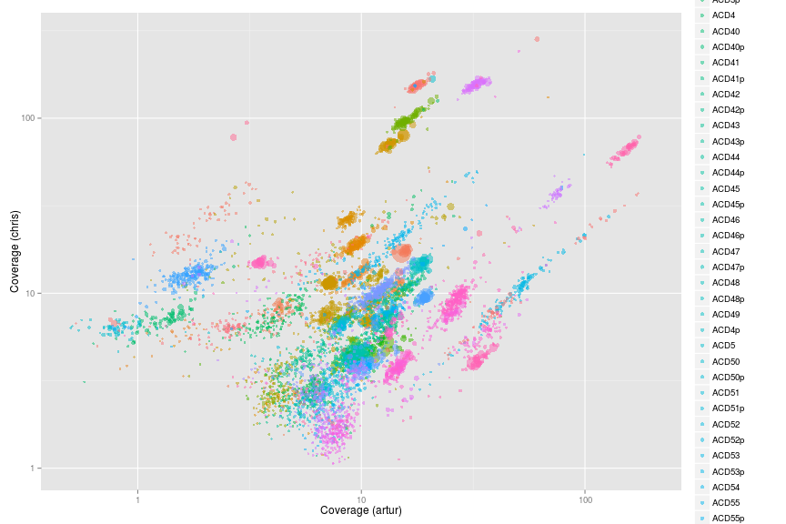 

### Looking at the 5 orginal OD1 bins from Wrighton


w.d.od1 <- subset(w.d, bin == "ACD7" | bin == "ACD11" | bin == "ACD18" | bin == "ACD81" | bin == "ACD1")



ggplot(w.d.od1, aes(x = artur, y = dolly, color = bin, size = length)) + 
  scale_x_log10(limits = c(0.5, 200)) + 
  scale_y_log10(limits = c(1, 300)) + 
  xlab("Coverage (artur)") + 
  ylab("Coverage (chris)") + 
  geom_point(alpha = 0.5) + 
  scale_size_area(name = "Scaffold length", max_size = 10)


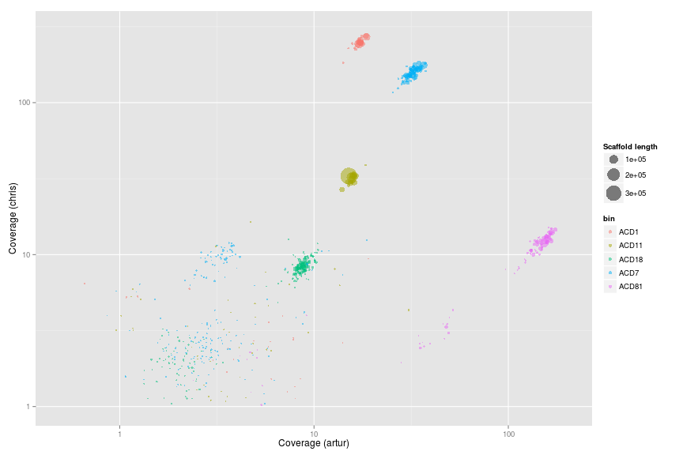 

## Genome extraction

### ACD7 (ID1)


palette(rgb.a)

x <- "artur"
y <- "dolly"

plot(d[, x], d[, y], log = "xy", cex = sqrt(d$length)/100, pch = 20, col = d$gc - min(d$gc), xlim = c(10, 110), ylim = c(110, 330), xlab = "artur", ylab = "dolly")

# def<-locator(100, type='p', pch=20)

def <- {}
def$x <- c(22.53, 29.37, 43.54, 41.99, 32.09, 22.00, 21.65)
def$y <- c(158.24, 198.66, 196.48, 147.04, 112.07, 111.66, 125.12)

selection.A <- ahull(def, alpha = 1e+05)

plot(selection.A, col = "black", add = T)


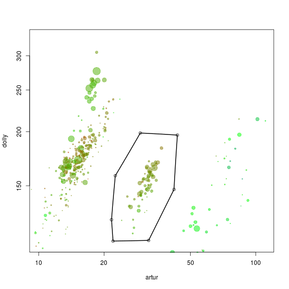 

Extract all scaffolds and information on essential genes within the defined subspace using the `extract` function.


s.A <- extract(d, selection.A, d[, x], d[, y])
e.A <- extract(e, selection.A, e[, x], e[, y])


See the basic statistics of the selected scaffolds.


calc.genome.stats(s.A, e.A)



total.length 1411386.0
# scaffolds       59.0
mean.length    23921.8
max.length    110546.0
gc                34.9
artur             31.6
dolly            154.2
chris            151.4
tot.ess           96.0
uni.ess           96.0


Add the genome statistics to a list and print the name of the scaffolds to a file for further refinement.


genome.stats <- rbind(genome.stats, t(calc.genome.stats(s.A, e.A)))
rownames(genome.stats)[nrow(genome.stats)] <- "ACD7"
show(genome.stats)



     total.length # scaffolds mean.length max.length   gc artur dolly chris tot.ess uni.ess
ACD7      1411386          59       23922     110546 34.9  31.6 154.2 151.4      96      96



write.table(g1.s.A$name, file = "ACD7.txt", quote = F, row.names = F, col.names = F)


The name of the scaffolds can be used to extract the scaffolds from the original `assembly.fa`.

### ACD11 (ID7)


palette(rgb.a)

x <- "artur"
y <- "chris"

plot(d[, x], d[, y], log = "xy", cex = sqrt(d$length)/100, pch = 20, col = d$gc - min(d$gc), xlim = c(14, 20), ylim = c(12, 24), xlab = "Coverage (artur)", ylab = "Coverage (chris)")

# def<-locator(100, type='p', pch=20)

def <- {}
def$x <- c(14.49, 15.44, 16.40, 16.43, 15.84, 14.88, 14.18, 14.29)
def$y <- c(18.89, 19.86, 18.51, 16.86, 16.37, 15.91, 16.21, 17.35)

selection.A <- ahull(def, alpha = 1e+05)

plot(selection.A, col = "black", add = T)


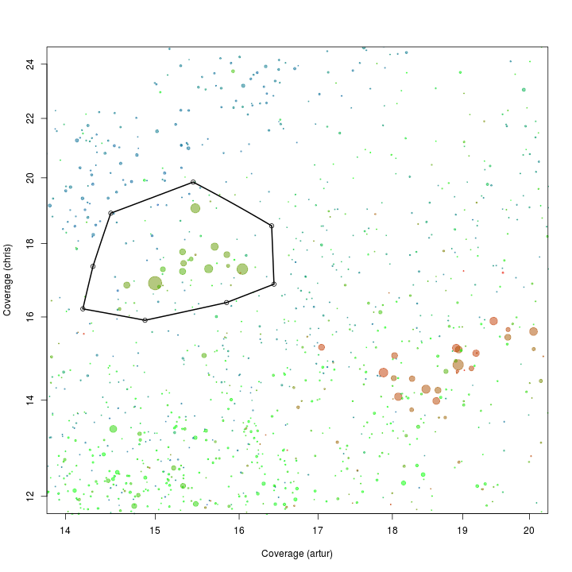 

Extract all scaffolds and information on essential genes within the defined subspace using the `extract` function.


s.A <- extract(d, selection.A, d[, x], d[, y])
e.A <- extract(e, selection.A, e[, x], e[, y])


See the basic statistics of the selected scaffolds.


calc.genome.stats(s.A, e.A)



total.length 1074415.0
# scaffolds       76.0
mean.length    14137.0
max.length    220980.0
gc                38.5
artur             15.4
dolly             29.0
chris             17.5
tot.ess           97.0
uni.ess           91.0


Which of the single copy genes are duplicated? Note that some genomes might have duplicates of some "single copy genes".


d.A <- e.A[which(duplicated(e.A$hmm.id) | duplicated(e.A$hmm.id, fromLast = TRUE)), ]
d.A[order(d.A$hmm.id), c(1, 3, 9)]



      name     hmm.id       phylum.x
713   1361 PF00750.14           <NA>
4584   536 PF00750.14     Firmicutes
5264   735 PF00750.14     Firmicutes
1897 22123  TIGR01009 Proteobacteria
2928  3244  TIGR01009     Firmicutes
1898 22123  TIGR01044 Proteobacteria
2927  3244  TIGR01044     Firmicutes
1899 22123  TIGR01050 Proteobacteria
2926  3244  TIGR01050     Firmicutes
5261   735  TIGR02012     Firmicutes
5284  7436  TIGR02012           <NA>


As there is multiple genomes in the subset we make a PCA on the scaffolds in the subset.


rda <- rda(kmer[s.A$name, 2:ncol(kmer)], scale = T)
scores <- scores(rda, choices = 1:5)$sites

s.B <- cbind(s.A, scores)
e.B <- merge(e.A, s.B[, c(1, 9:13)], all.x = T, by = "name")
d.B <- merge(d.A, s.B[, c(1, 9:13)], all.x = T, by = "name")


We use the pairs function to plot the first 3 components along with GC and coverages.


palette(rgb.a)
pairs(s.B[, c(4, 5, 6, 3, 10:12)], upper.panel = NULL, col = s.B$gc - min(d$gc), cex = sqrt(s.B$length)/100, pch = 20)


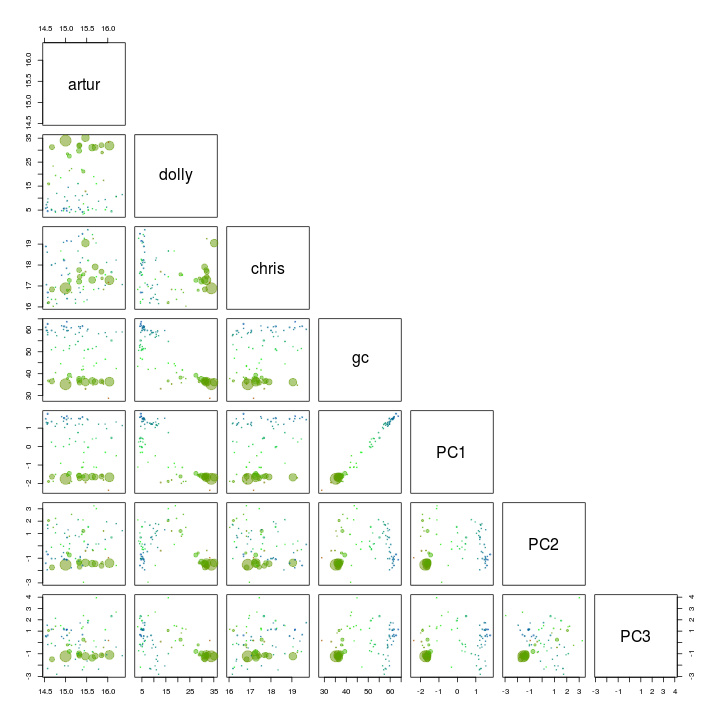 

GC and PC1 seem to seperate our target genome from the other scaffolds and is therefore used for another extraction using the locator function.


palette(rgb.a)

x <- "PC1"
y <- "gc"

plot(s.B[, x], s.B[, y], cex = sqrt(s.B$length)/100, pch = 20, col = s.B$gc - min(d$gc), xlab = x, ylab = y)

palette(brewer.pal(9, "Set1"))

points(s.B[, x], s.B[, y], col = s.B$tax.color + 1, pch = 20)

# def<-locator(100, type='p', pch=20)

def <- {}
def$x <- c(-2.24, -1.92, -1.32, -1.11, -1.35, -1.91, -2.21)
def$y <- c(36.54, 41.04, 41.34, 38.59, 33.38, 30.21, 30.93)

selection.B <- ahull(def, alpha = 1e+05)

plot(selection.B, col = "black", add = T)


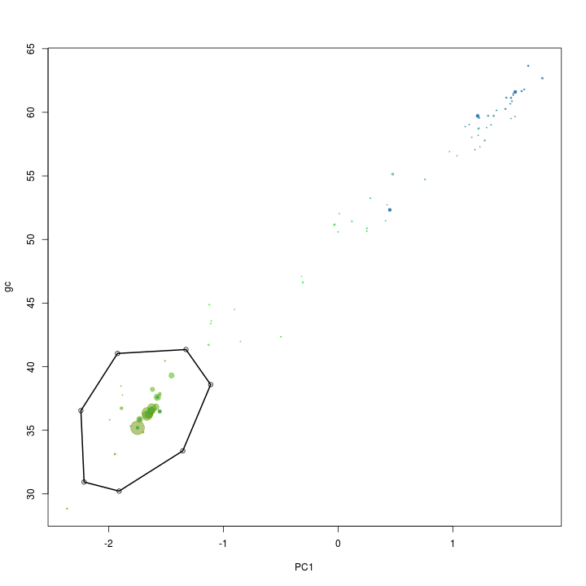 

Again the `extract` function is used to retrive the scaffolds in the selected subset.


s.C <- extract(s.B, selection.B, s.B[, x], s.B[, y])
e.C <- extract(e.B, selection.B, e.B[, x], e.B[, y])


See the basic statistics of the selected scaffolds.


calc.genome.stats(s.C, e.C)



total.length 955434.0
# scaffolds      22.0
mean.length   43428.8
max.length   220980.0
gc               36.3
artur            15.4
dolly            31.7
chris            17.4
tot.ess          91.0
uni.ess          89.0


There are a few duplicated "single copy genes" however in this case it is not due to mulitple species in the bin, but real duplicates in the genome.


d.C <- e.C[which(duplicated(e.C$hmm.id) | duplicated(e.C$hmm.id, fromLast = TRUE)), ]
d.C[order(d.C$hmm.id), c(1, 3, 9)]



   name     hmm.id   phylum.x
4   536 PF00750.14 Firmicutes
21  735 PF00750.14 Firmicutes
28 1361 PF00750.14       <NA>


Add the genome statistics to a list and print the name of the scaffolds to a file for further refinement.


genome.stats <- rbind(genome.stats, t(calc.genome.stats(s.C, e.C)))
rownames(genome.stats)[nrow(genome.stats)] <- "ACD11"
show(genome.stats)



      total.length # scaffolds mean.length max.length   gc artur dolly chris tot.ess uni.ess
ACD7       1411386          59       23922     110546 34.9  31.6 154.2  151.4      96      96
ACD11       955434          22       43429     220980 36.3  15.4  31.7   17.4      91      89



write.table(s.C$name, file = "ACD11.txt", quote = F, row.names = F, col.names = F)


### ACD18 (ID3)


palette(rgb.a)

x <- "artur"
y <- "chris"

plot(d[, x], d[, y], log = "xy", cex = sqrt(d$length)/100, pch = 20, col = d$gc - min(d$gc), xlim = c(5, 15), ylim = c(20, 35), xlab = "Coverage (artur)", ylab = "Coverage (chris)")

# def<-locator(100, type='p', pch=20)

def <- {}
def$x <- c(7.12, 7.75, 8.80, 10.54, 10.91, 10.97, 9.70, 8.65, 7.66, 6.81, 6.96)
def$y <- c(26.89, 28.41, 30.11, 29.28, 27.47, 25.55, 24.59, 23.85, 22.95, 23.46, 25.60)

selection.A <- ahull(def, alpha = 1e+05)

plot(selection.A, col = "black", add = T)


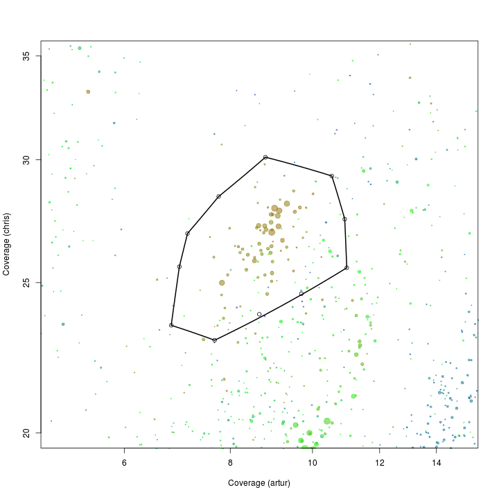 

Extract all scaffolds and information on essential genes within the defined subspace using the `extract` function.


s.A <- extract(d, selection.A, d[, x], d[, y])
e.A <- extract(e, selection.A, e[, x], e[, y])


See the basic statistics of the selected scaffolds.


calc.genome.stats(s.A, e.A)



total.length 1230983.0
# scaffolds      110.0
mean.length    11190.8
max.length     65437.0
gc                34.0
artur              8.9
dolly              8.6
chris             26.7
tot.ess           92.0
uni.ess           86.0


Which of the single copy genes are duplicated? Note that some genomes might have duplicates of some "single copy genes".


d.A <- e.A[which(duplicated(e.A$hmm.id) | duplicated(e.A$hmm.id, fromLast = TRUE)), ]
d.A[order(d.A$hmm.id), c(1, 3, 9)]



      name     hmm.id       phylum.x
3795 43010 PF00297.17 Proteobacteria
4944  5995 PF00297.17     Firmicutes
4285 49498 PF00411.14           <NA>
4615   540 PF00411.14     Firmicutes
4286 49498 PF00416.17           <NA>
4617   540 PF00416.17     Firmicutes
3796 43010 PF00573.17 Proteobacteria
4942  5995 PF00573.17     Firmicutes
607  13098  TIGR00436           <NA>
5431  8080  TIGR00436     Firmicutes
4613   540  TIGR02027     Firmicutes
5630  9043  TIGR02027 Proteobacteria


As there is multiple genomes in the subset we make a PCA on the scaffolds in the subset.


rda <- rda(kmer[s.A$name, 2:ncol(kmer)], scale = T)
scores <- scores(rda, choices = 1:5)$sites

s.B <- cbind(s.A, scores)
e.B <- merge(e.A, s.B[, c(1, 9:13)], all.x = T, by = "name")
d.B <- merge(d.A, s.B[, c(1, 9:13)], all.x = T, by = "name")


We use the pairs function to plot the first 5 components. I've also added GC and coverage.


palette(rgb.a)
pairs(s.B[, c(4, 5, 6, 3, 10:12)], upper.panel = NULL, col = s.B$gc - min(d$gc), cex = sqrt(s.B$length)/100, pch = 20)


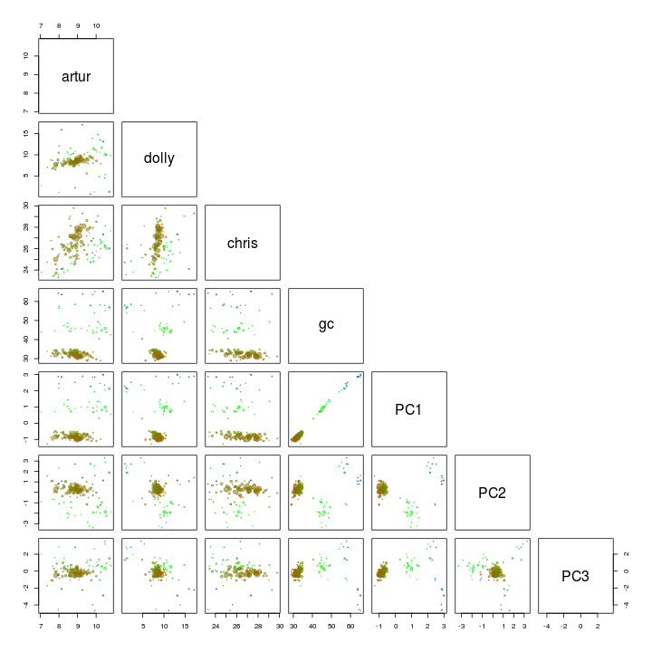 

PC1 and PC2 seem to seperate our target genome from the other scaffolds and is therefore used for another extraction using the locator function.


palette(rgb.a)

x <- "PC1"
y <- "PC2"

plot(s.B[, x], s.B[, y], cex = sqrt(s.B$length)/100, pch = 20, col = s.B$gc - min(d$gc), xlab = x, ylab = y)

palette(brewer.pal(9, "Set1"))

points(s.B[, x], s.B[, y], col = s.B$tax.color + 1, pch = 20)

# def<-locator(100, type='p', pch=20)

def <- {}
def$x <- c(-1.39, -0.89, -0.27, -0.44, -1.12, -1.40)
def$y <- c(1.75, 1.93, 0.80, -2.00, -2.27, -0.54)

selection.B <- ahull(def, alpha = 1e+05)

plot(selection.B, col = "black", add = T)


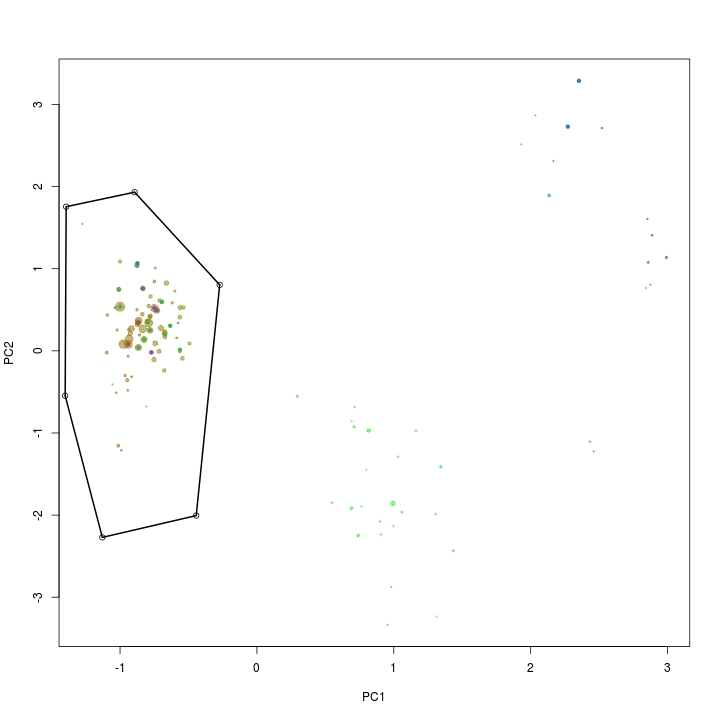 

Again the `extract` function is used to retrive the scaffolds in the selected subset.


s.C <- extract(s.B, selection.B, s.B[, x], s.B[, y])
e.C <- extract(e.B, selection.B, e.B[, x], e.B[, y])


See the basic statistics of the selected scaffolds.


calc.genome.stats(s.C, e.C)



total.length 1110432.0
# scaffolds       72.0
mean.length    15422.7
max.length     65437.0
gc                32.3
artur              8.8
dolly              8.5
chris             26.7
tot.ess           86.0
uni.ess           85.0


There are a few duplicated "single copy genes" however in this case it is not due to mulitple species in the bin, but real duplicates in the genome.


d.C <- e.C[which(duplicated(e.C$hmm.id) | duplicated(e.C$hmm.id, fromLast = TRUE)), ]
d.C[order(d.C$hmm.id), c(1, 3, 9)]



    name    hmm.id   phylum.x
73  8080 TIGR00436 Firmicutes
80 13098 TIGR00436       <NA>


Add the genome statistics to a list and print the name of the scaffolds to a file for further refinement.


genome.stats <- rbind(genome.stats, t(calc.genome.stats(s.C, e.C)))
rownames(genome.stats)[nrow(genome.stats)] <- "ACD18"
show(genome.stats)



      total.length # scaffolds mean.length max.length   gc artur dolly chris tot.ess uni.ess
ACD7       1411386          59       23922     110546 34.9  31.6 154.2  151.4      96      96
ACD11       955434          22       43429     220980 36.3  15.4  31.7   17.4      91      89
ACD18      1110432          72       15423      65437 32.3   8.8   8.5   26.7      86      85



write.table(s.C$name, file = "ACD18.txt", quote = F, row.names = F, col.names = F)


### ACD81 (ID16)


palette(rgb.a)

x <- "artur"
y <- "chris"

plot(d[, x], d[, y], log = "xy", cex = sqrt(d$length)/100, pch = 20, col = d$gc - min(d$gc), xlim = c(50, 400), ylim = c(20, 100), xlab = "Coverage (artur)", ylab = "Coverage (chris)")

# def<-locator(100, type='p', pch=20)

def <- {}
def$x <- c(141.32, 182.22, 220.68, 206.56, 154.17, 115.47, 91.13, 106.59)
def$y <- c(77.13, 89.70, 82.59, 66.62, 52.24, 42.95, 47.99, 59.07)

selection.A <- ahull(def, alpha = 1e+05)

plot(selection.A, col = "black", add = T)


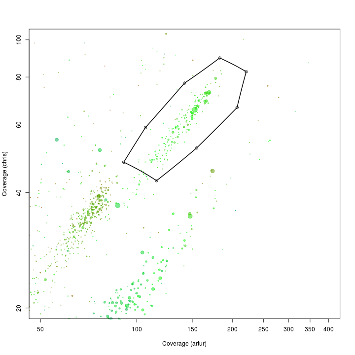 

Extract all scaffolds and information on essential genes within the defined subspace using the `extract` function.


s.A <- extract(d, selection.A, d[, x], d[, y])
e.A <- extract(e, selection.A, e[, x], e[, y])


See the basic statistics of the selected scaffolds.


calc.genome.stats(s.A, e.A)



##                      
## total.length 835481.0
## # scaffolds     161.0
## mean.length    5189.3
## max.length    85982.0
## gc               43.3
## artur           147.5
## dolly            12.4
## chris            63.8
## tot.ess          76.0
## uni.ess          74.0


Which of the single copy genes are duplicated? Note that some genomes might have duplicates of some "single copy genes".


d.A <- e.A[which(duplicated(e.A$hmm.id) | duplicated(e.A$hmm.id, fromLast = TRUE)), ]
d.A[order(d.A$hmm.id), c(1, 3, 9)]



     name    hmm.id   phylum.x
3170 3520 TIGR00442 Firmicutes
5429  802 TIGR00442       <NA>
5231 7191 TIGR00981 Firmicutes
5482  828 TIGR00981       <NA>


As there is multiple genomes in the subset we make a PCA on the scaffolds in the subset.


rda <- rda(kmer[s.A$name, 2:ncol(kmer)], scale = T)
scores <- scores(rda, choices = 1:5)$sites

s.B <- cbind(s.A, scores)
e.B <- merge(e.A, s.B[, c(1, 9:13)], all.x = T, by = "name")
d.B <- merge(d.A, s.B[, c(1, 9:13)], all.x = T, by = "name")


We use the pairs function to plot the first 3 components. I've also added GC and coverage.


palette(rgb.a)
pairs(s.B[, c(4, 5, 6, 3, 10:12)], upper.panel = NULL, col = s.B$gc - min(d$gc), cex = sqrt(s.B$length)/100, pch = 20)


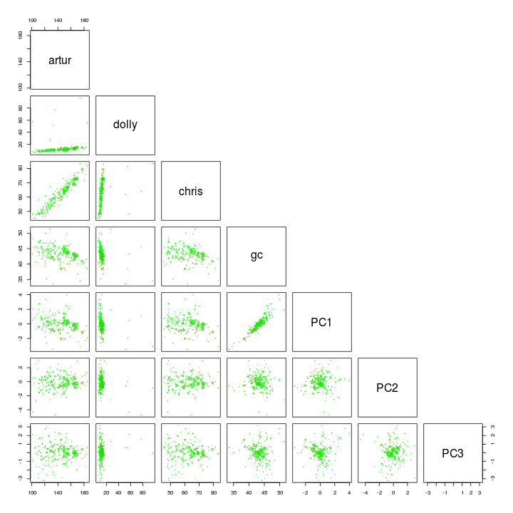 

Dolly and PC1 seem to seperate our target genome from the other scaffolds and is therefore used for another extraction using the locator function.


palette(rgb.a)

x <- "dolly"
y <- "PC1"

plot(s.B[, x], s.B[, y], cex = sqrt(s.B$length)/100, pch = 20, col = s.B$gc - min(d$gc), xlab = x, ylab = y)

palette(brewer.pal(9, "Set1"))

points(s.B[, x], s.B[, y], col = s.B$tax.color + 1, pch = 20)

# def<-locator(100, type='p', pch=20)

def <- {}
def$x <- c(4.70, 10.45, 21.96, 25.94, 19.75, 6.91, 4.26, 3.48)
def$y <- c(3.08, 4.14, 3.67, 0.09, -2.74, -3.08, -0.75, 1.24)

selection.B <- ahull(def, alpha = 1e+05)

plot(selection.B, col = "black", add = T)


 

Again the `extract` function is used to retrive the scaffolds in the selected subset.


s.C <- extract(s.B, selection.B, s.B[, x], s.B[, y])
e.C <- extract(e.B, selection.B, e.B[, x], e.B[, y])


See the basic statistics of the selected scaffolds.


calc.genome.stats(s.C, e.C)



total.length 826830.0
# scaffolds     155.0
mean.length    5334.4
max.length    85982.0
gc               43.4
artur           147.6
dolly            11.9
chris            63.7
tot.ess          76.0
uni.ess          74.0


There are a few duplicated "single copy genes". In this case it might indicate that the bin includes a small amount of another bacteria. It can be cleaned up by using the cytoscape network graph approach.


d.C <- e.C[which(duplicated(e.C$hmm.id) | duplicated(e.C$hmm.id, fromLast = TRUE)), ]
d.C[order(d.C$hmm.id), c(1, 3, 9)]



   name    hmm.id   phylum.x
53  802 TIGR00442       <NA>
67 3520 TIGR00442 Firmicutes
56  828 TIGR00981       <NA>
75 7191 TIGR00981 Firmicutes


Add the genome statistics to a list and print the name of the scaffolds to a file for further refinement.


genome.stats <- rbind(genome.stats, t(calc.genome.stats(s.C, e.C)))
rownames(genome.stats)[nrow(genome.stats)] <- "ACD81"
show(genome.stats)



      total.length # scaffolds mean.length max.length   gc artur dolly  chris tot.ess uni.ess
ACD7       1411386          59       23922     110546 34.9  31.6 154.2  151.4      96      96
ACD11       955434          22       43429     220980 36.3  15.4  31.7   17.4      91      89
ACD18      1110432          72       15423      65437 32.3   8.8   8.5   26.7      86      85
ACD81       826830         155        5334      85982 43.4 147.6  11.9   63.7      76      74



write.table(s.C$name, file = "ACD81.txt", quote = F, row.names = F, col.names = F)


### ACD1 (ID2)


palette(rgb.a)

x <- "artur"
y <- "chris"

plot(d[, x], d[, y], log = "xy", cex = sqrt(d$length)/100, pch = 20, col = d$gc - min(d$gc), xlim = c(10, 40), ylim = c(50, 200), xlab = "Coverage (artur)", ylab = "Coverage (chris)")

# def<-locator(100, type='p', pch=20)

def <- {}
def$x <- c(13.56, 18.23, 22.18, 20.97, 14.47, 12.58)
def$y <- c(137.01, 183.62, 163.20, 139.54, 111.12, 113.64)

selection.A <- ahull(def, alpha = 1e+05)

plot(selection.A, col = "black", add = T)


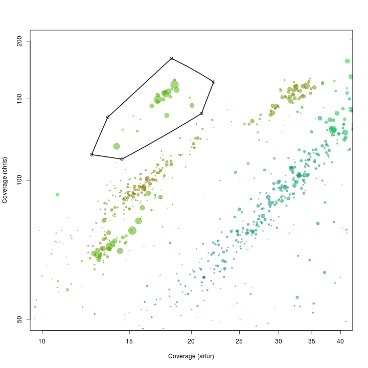 

Extract all scaffolds and information on essential genes within the defined subspace using the `extract` function.


s.A <- extract(d, selection.A, d[, x], d[, y])
e.A <- extract(e, selection.A, e[, x], e[, y])


See the basic statistics of the selected scaffolds.


calc.genome.stats(s.A, e.A)



total.length 1269939.0
# scaffolds       23.0
mean.length    55214.7
max.length    176667.0
gc                38.3
artur             17.5
dolly            249.1
chris            149.2
tot.ess           97.0
uni.ess           94.0


Which of the single copy genes are duplicated? Note that some genomes might have duplicates of some "single copy genes".


d.A <- e.A[which(duplicated(e.A$hmm.id) | duplicated(e.A$hmm.id, fromLast = TRUE)), ]
d.A[order(d.A$hmm.id), c(1, 3, 9)]



     name     hmm.id   phylum.x
2316 2608 PF00750.14 Firmicutes
4299 4971 PF00750.14 Firmicutes
943  1510  TIGR00029 Firmicutes
2390  270  TIGR00029       <NA>
357   119  TIGR00442 Firmicutes
1685 2054  TIGR00442 Firmicutes


As there is multiple genomes in the subset we make a PCA on the scaffolds in the subset.


rda <- rda(kmer[s.A$name, 2:ncol(kmer)], scale = T)
scores <- scores(rda, choices = 1:5)$sites

s.B <- cbind(s.A, scores)
e.B <- merge(e.A, s.B[, c(1, 9:13)], all.x = T, by = "name")
d.B <- merge(d.A, s.B[, c(1, 9:13)], all.x = T, by = "name")


We use the pairs function to plot the first 3 components. I've also added GC and coverage. There is nothing obiouvs that can be removed.


palette(rgb.a)
pairs(s.B[, c(4, 5, 6, 3, 10:12)], upper.panel = NULL, col = s.B$gc - min(d$gc), cex = sqrt(s.B$length)/100, pch = 20)


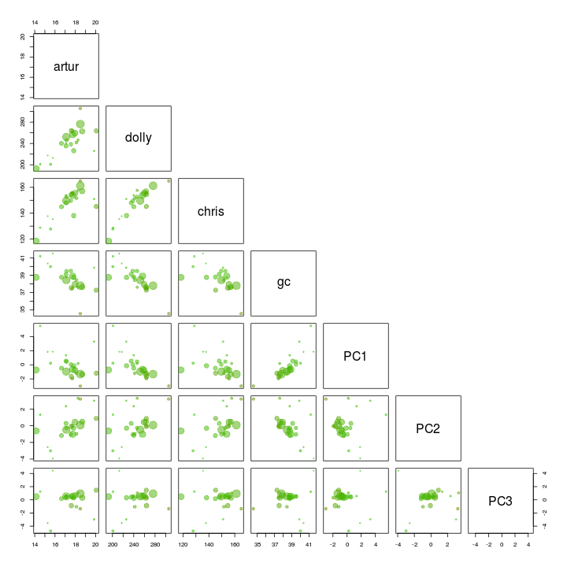 

Add the genome statistics to a list and print the name of the scaffolds to a file for further refinement.


genome.stats <- rbind(genome.stats, t(calc.genome.stats(s.B, e.B)))
rownames(genome.stats)[nrow(genome.stats)] <- "ACD1"
show(genome.stats)



      total.length # scaffolds mean.length max.length   gc artur dolly  chris tot.ess uni.ess
ACD7       1411386          59       23922     110546 34.9  31.6 154.2  151.4      96      96
ACD11       955434          22       43429     220980 36.3  15.4  31.7   17.4      91      89
ACD18      1110432          72       15423      65437 32.3   8.8   8.5   26.7      86      85
ACD81       826830         155        5334      85982 43.4 147.6  11.9   63.7      76      74
ACD1       1269939          23       55215     176667 38.3  17.5 249.1  149.2      97      94



write.table(s.B$name, file = "ACD1.txt", quote = F, row.names = F, col.names = F)


